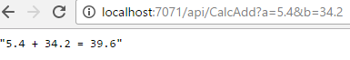

# Experimenting with Azure Functions
This is a simple function that adds 2 numbers. But it does it using Azure Functions, so that makes it awesome.  

# Setup
I am running Visual Studio 2015 with the [preview tooling](https://blogs.msdn.microsoft.com/webdev/2016/12/01/visual-studio-tools-for-azure-functions/) for Azure Functions. I will test with VS2017 tooling when it becomes available.

# Deployment
This repo can be configured with [continuous deployment](https://github.com/Azure/azure-content-nlnl/blob/master/articles/azure-functions/functions-continuous-deployment.md) to your Azure Functions instance.

# Example Output

